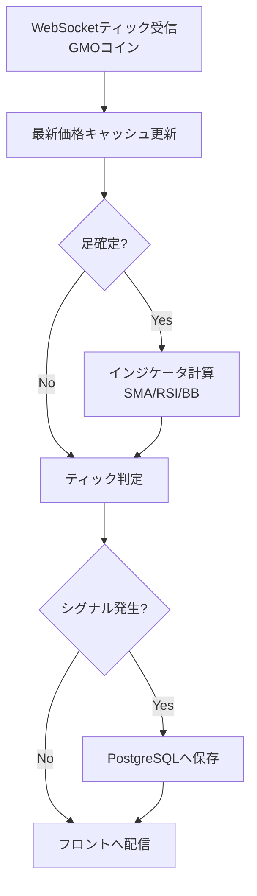

# FXリアルタイムモニター＆シグナルシステム設計メモ（GMOコイン対応）

## ゴール
- GMOコイン（https://api.coin.z.com/docs/）のPublic WebSocketからFXティックを取得し、1分足・5分足の指標（SMA/RSI/ボリンジャーバンド）を更新。
- ティックごとに複数の売買ロジック（逆張り・順張り）でシグナル判定。
- GMOコイン Private API（REST）に接続する `GMOClient` と `LiveTradingController` を用意し、`.env` の `GMO_API_KEY` / `GMO_API_SECRET` を設定すれば市場成行注文を自動発注できる。`trading_active` が `true` のときのみ発注し、未設定の場合は従来通りシミュレーションのみ（LiveTradingController は無効）。
- シグナル発生時だけPostgreSQLへ履歴保存し、Reactフロントでリアルタイム表示。

## 技術スタック
- **バックエンド**: Python 3.12 + FastAPI, websockets/aiohttp, pandas, pandas_ta, SQLAlchemy, Alembic
- **ミドルウェア**: PostgreSQL (Render Managed). 将来スケール用にRedis等の導入余地を残す。
- **フロントエンド**: React + TypeScript + Vite, React Query, WebSocket API, UI（Tailwind CSS or Chakra UI）
- **デプロイ**: Render（FastAPI Web Service, React Static Site, Managed PostgreSQL）

## GMOコイン WebSocket要点
- エンドポイント (FX): `wss://forex-api.coin.z.com/ws/public/v1`
- 主要チャンネル:
  - `ticker`（最新レート: ask/bid/last/volume/timestamp）
  - `orderbooks`（板情報）
  - `trades`（約定履歴）
- 購読メッセージ例:
  ```json
  {"command":"subscribe","channel":"ticker","symbol":"USD_JPY"}
  ```
- Public WebSocketは認証不要。リクエストは1秒に1回が上限のため、接続時はRateLimiterでsubscribe間隔を制御。
- Private REST API を利用する場合は `GET: 6回/秒`、`POST: 1回/秒` の制限を守る（`services/rate_limiter.py` にラッパーを用意）。

## システム全体フロー


## バックエンド構成案
```
backend/
  app/
    main.py                # FastAPI初期化, 起動フック
    deps.py                # DI/設定
    configs.py             # 設定管理（APIキー, 銘柄リスト, トリガー閾値）
    api/
      routes/
        websocket.py       # /ws/prices で最新価格/シグナルをpush
        signals.py         # /api/signals/history などREST
    core/
      stream.py            # GMOコインWSの接続・再接続
      candles.py           # 1分/5分足集約・足確定判定
      indicators.py        # pandas/pandas_taでインジ計算
      signals.py           # BB逆張りなどのシグナル判定
      notifier.py          # 判定結果をWebSocketブロードキャストへ渡す
    repositories/
      signals_repo.py      # PostgreSQL書き込み
    models/
      signal.py            # SQLAlchemyモデル
    schemas/
      signal.py            # Pydanticレスポンス
    services/
      indicator_store.py   # メモリキャッシュ（最新指標, dataclasses）
    utils/
      time.py, logger.py
  tests/
    unit/*
    integration/*
```

### 主要処理の詳細
- **ティック受信（core/stream.py）**
- `websockets.connect` で `wss://forex-api.coin.z.com/ws/public/v1` に接続。
  - 心拍監視（30sec ping/pong）、エラー時は指数バックオフで再接続。
  - 購読チャンネル: 最低限 `ticker`（USD_JPYなどFXペア）。追加で必要なら `orderbooks`。
  - 受信ごとに非同期Queueへティックデータをpush。
- **足集約（core/candles.py）**
  - Queueからティックを取り出し、1分/5分バケット単位でOHLCVを更新。
  - 足確定条件: `floor(timestamp/60) != 現行分` でフラッシュし、新しいDataFrameへappend。
- **インジケータ計算（core/indicators.py）**
- pandasでOHLCを保持し、pandas_ta等を利用してSMA(5/21)/RSI(14)/BB(21±2,±3)を計算。RCI(6/9/27)は自前実装。
- 線形回帰（Window=10本）でSMA21の傾きを算出し、1.5pipsを閾値に上昇/下降/横ばいを判定。
- 結果は `IndicatorSnapshot` に格納し、WebSocketで `indicator` イベントとして配信。
- **シグナル判定 + ポジション管理（core/signals.py / services/positions.py）**
  - ティック受信ごとに最新スナップショットを参照し、以下の6ロジックを評価（クールダウン＋タイムフレーム別の重複抑制付き）。
    1. **BB逆張り（1分）**: トレンドが横ばい/逆行時にBB±2σタッチとRSI閾値で逆張り。
    2. **SMA21タッチ反発（1分）**: トレンド方向と一致し、足がSMA21へタッチして反発したら順張り。
    3. **SMA21タッチ反発（5分）**: 5分足でも同様の反発を検知。
    4. **高値・安値フェイクブレイク（1分）**: 1分/5分が横ばいで直近5本の高安をフェイクブレイクしたら逆張り。
    5. **移動平均クロス順張り（1分）**: SMA5とSMA21のクロスをトレンド方向で追随。
    6. **トレンド押し目・戻り目（1分）**: 傾きが一定以上のとき、SMA5タッチで押し目/戻り目エントリー。
  - 各ロジックごとに履歴を保持し、WebSocketとREST（`/api/trading/signals/history`）で取得可能。
  - `PositionManager` は Lot・pipサイズ・損切り/利確pips・手数料率（0.002%）を保持。ポジションオープン時にオープン手数料、クローズ時にクローズ手数料を差し引いた純損益を算出。
- 取引設定（pipサイズ/ロット/損切り・利確/手数料率）は `TradingConfigStore`（JSON, `runtime/trading_config.json`）へ自動保存され、再起動後も引き継がれる。
- 実取引のON/OFFをAPI経由で制御でき、停止中でも価格ストリームと指標更新は継続。UIの開始/停止ボタンは `/api/trading/config` に `trading_active` を送信して切り替える。
  - 損益計算: `PnL = (価格差 × lot × 方向) - (open_fee + close_fee)`。各イベントに `fee_paid` を付与し、履歴に反映。
- **API層**
  - `/ws/prices`: ティック・足・指標・シグナル・ポジションイベントを push。
  - `/api/trading/config`: 逆張りロジックの各種パラメータを取得/更新。
- `/api/trading/positions`: 現在のポジション一覧を返却（オープン手数料・評価損益を含む）。
  - `/api/trading/positions/{symbol}/close`: 手動クローズ。
- **API層**
  - `/ws/prices`: FastAPI `WebSocket`。バックエンド内の`Broadcast`（Starlette）か`asyncio.Queue`でリアルタイムpush。
  - `/api/signals/latest`: 直近シグナルを返す。
  - `/api/signals/history?limit=100&cursor=...`: ページング対応。React Queryで利用。
- **永続化**
  - Alembicでマイグレーション管理。
  - テーブル定義:
    ```sql
    CREATE TABLE signals (
      id            SERIAL PRIMARY KEY,
      occurred_at   timestamptz NOT NULL,
      symbol        text NOT NULL,
      price         numeric(18,6) NOT NULL,
      timeframe     text NOT NULL,
      sma           numeric(18,6),
      rsi           numeric(10,4),
      bb_upper      numeric(18,6),
      bb_lower      numeric(18,6),
      signal_type   text NOT NULL CHECK (signal_type IN ('BUY','SELL')),
      metadata      jsonb DEFAULT '{}'::jsonb
    );
    CREATE INDEX idx_signals_occurred_at ON signals (occurred_at DESC);
    CREATE INDEX idx_signals_symbol_timeframe ON signals (symbol, timeframe);
    ```

## フロントエンド設計
- **主要ビュー**
  1. **ヘッダー/ステータス**: 現在の接続状態・遅延ms。
  2. **最新レートカード**: bid/ask/spread, 前日比。WebSocketイベントで即時更新。
  3. **最新シグナルパネル**: 方向（BUY/SELL）, 価格, timeframe, 発生時刻。
  4. **履歴テーブル**: ページング or 無限スクロール, タグ/フィルタ（銘柄, timeframe, シグナル種別）。
  5. （拡張）チャート描画: `lightweight-charts` で1分足を描画し、シグナル位置にマーカーを表示。
- **状態管理**
  - WebSocket → Zustand store（`useMarketStore`）。
  - RESTレスポンス → React Query (`useQuery` / `useInfiniteQuery`).
  - 接続が切れた場合はトースト通知し、自動再接続（指数バックオフ）。
- **コンポーネント構成例**
  - `App.tsx`
  - `components/PriceTicker.tsx`
  - `components/SignalBadge.tsx`
  - `components/SignalTable.tsx`
  - `components/LatencyIndicator.tsx`
  - `hooks/useMarketWS.ts`
  - `services/api.ts`

### 実装済みUI
- 価格・指標・ポジションをカード/テーブルで可視化。チャート表示は無し。
- **3つのタブビュー**: モニタリング／ロジック分析／パフォーマンス分析
  - **モニタリング**: リアルタイムの価格・ポジション・インジケータを表示
  - **ロジック分析**: 戦略別のシグナル履歴テーブル（時刻・方向・価格・決済・損益pips）
  - **パフォーマンス分析**: 戦略別の統計サマリー（勝率・総損益・平均損益・最大利益/損失）。デフォルト期間は当日07:00 JST〜翌朝05:00 JST
- `TradingConfigForm` から Lot数/損切りpips/利確pips/ATRしきい値 を操作可能（pipサイズと手数料率は読み取り専用）。
- `PositionPanel` で保有ポジションの評価損益・手数料を確認、手動クローズボタンあり。
- `IndicatorPanel` で SMA5/21・RSI14・ATR14・RCI6/9/27・BB21±2/±3・トレンド（傾きpips）を表示。
- `SignalList` にシグナル時点の SMA/RSI とトレンド判定を表示。
- `IndicatorPanel` / `CandleTable` で最新1分・5分足のOHLCとインジケータ値を確認。
- `PerformancePanel` で期間指定フィルタを使い、戦略ごとの総トレード数・勝率・総損益・総Pips・平均損益・最大利益/損失を一覧表示。初期表示は当日07:00 JST〜翌朝05:00 JSTの統計。リセットボタンでデフォルト期間に戻る。

### 2025-09アップデート概要
- **取引エンジン**
  - Trend 判定は SMA21（ブラウザで変更可）のローリング値を線形回帰し、十分な本数が揃うまで `ready=False` として全ロジックのシグナル生成を抑止。
  - 閾値 `trend_threshold_pips` も設定フォームから変更可能。
  - **ATRフィルタ**: 1分足のATR(14)を計算し、`atr_threshold_pips` 未満の場合は全ロジックのシグナル生成を抑止。設定フォームから閾値を変更可能（デフォルト2.0pips）。
  - 戦略ごとにポジションを独立保持し、決済シグナルには損益(pips)と元戦略名を付与。
  - 新規注文はスプレッドが 0.5 以上の場合スキップ。決済注文は常に実行。
  - 日本時間で 04:00〜09:15／21:20〜21:45／22:25〜23:10 のブラックアウト中は、新規発注のみ停止し、保有ポジションの決済注文は継続。
  - ブラウザの取引設定フォームからブラックアウト時間帯を追加・削除でき、更新内容は `runtime/trading_config.json` に保存され再起動後も維持される。
- **シグナル永続化**
  - `core.stream.MarketStream` から発行されるシグナル／決済イベントは `services.signals_repository.SignalRepository` を介して PostgreSQL (`signal_events` テーブル) に保存するよう統合（2025-10）。
  - シグナル履歴 API は引き続きメモリ保持 (`SignalEngine._histories`) を利用しており、DB からの読み出しは未実装。フロントエンド表示を切り替える際は注意すること。
- **実約定との整合性**
  - `services.execution_reconciler.ExecutionReconciler` が `latestExecutions` を周期的に取得し、`order_events` のステータスを更新。一定回数失敗した決済注文は自動的に再投入される。
  - 各注文状態は WebSocket の `order` イベントで配信され、フロントの注文ステータスパネルに反映される。
- **UI 構成**
  - モニタリングとロジック分析の 2 ビューに分割。タブ切り替えで利用。
  - 分析ビューではロジック別テーブル（時刻／方向／価格／決済／損益pips）のみ表示し、余計なフィルタやエクスポート機能は持たない。
  - 取引設定フォームに `trend_sma_period` と `trend_threshold_pips` の入力欄を追加。

- **API/永続化**
  - `TradingConfig` に `trend_sma_period`、`trend_threshold_pips`、`atr_threshold_pips` を追加し、`runtime/trading_config.json` へ保存。
  - `/api/trading/config` で全設定を取得・更新できるよう拡張。
  - `/api/trading/signals/summary` エンドポイントを追加し、戦略別のパフォーマンス統計（勝率・総損益・平均損益・最大利益/損失など）を取得可能。クエリパラメータ `from_date`、`to_date`、`strategy` で期間・戦略フィルタリングに対応。

## デプロイと運用（Render）
1. **FastAPIサービス**
   - Dockerfile例:
     ```Dockerfile
     FROM python:3.12-slim
     WORKDIR /app
     RUN pip install --upgrade pip && pip install poetry
     COPY pyproject.toml poetry.lock ./
     RUN poetry config virtualenvs.create false && poetry install --no-interaction --no-root
     COPY app ./app
     CMD ["uvicorn", "app.main:app", "--host", "0.0.0.0", "--port", "10000"]
     ```
   - Render環境変数: `DATABASE_URL`, `GMO_SYMBOLS=USD_JPY,EUR_JPY`, `SIGNAL_CONFIG=...`。
   - スタートコマンドでAlembicマイグレーション: `alembic upgrade head && uvicorn ...`。
2. **PostgreSQL**
   - Render Managed PostgreSQLを作成。バックアップ設定、SSL必須。
3. **Reactフロント**
   - `yarn build` → Render Static Site。
   - `VITE_API_BASE=https://<fastapi-service>.onrender.com` を設定。
4. **ドメイン/HTTPS**: Render標準。必要に応じてカスタムドメイン。
5. **監視**
   - FastAPIログでエラー検知。
   - RenderのHealth Check（`/healthz`）を追加し、WebSocket接続中も監視。
   - 将来的にはOpenTelemetry or Sentry導入。

## セキュリティと秘密情報管理
- `.env` や `.env.dev` などの環境変数ファイルには API キー・DB パスワードなどの秘密情報を保持し、Git にコミットしない。必要に応じて `direnv` や Render の環境変数管理を利用する。
- GMO API キーやデータベース資格情報は Docker Compose でも `env_file` で注入されるため、共有する際は Credential をマスクする。Pull Request やログに平文を出力しない。
- 本番環境では TLS 接続と Firewall を前提に、PostgreSQL への接続元を限定する。監査目的で API 呼び出し（`services/gmo_client.py`）の失敗ログにはシークレットを含めない。
- `.env` 内で値を更新したら `docs/fx_signal_system.md` の該当設定セクションも更新し、Secrets のライフサイクル（ローテーション手順・保管先）を明文化しておく。

## セキュリティ・信頼性
- WebSocket再接続時の一時データ欠落を最小にするため、最後の受信タイムスタンプを保持し、ギャップが生じた場合はREST APIで補完（`/public/v1/ticker`）。
- DB書き込みは非同期タスクで行い、APIレスポンス遅延を防止。
- Renderの環境変数で機密情報を管理。Gitに含めない。
- Alembic、pytest、mypy、ruffなどをCIに組み込む。

## ローカル開発環境（Docker Compose）
ローカルのPython/Node環境を汚さずに開発できるよう、Docker Composeでバックエンド・フロント・DBをまとめて起動する。

リポジトリ直下の `compose.yaml` を使って、以下の構成でスタックを起動できる。

```yaml
services:
  api:
    build:
      context: .
      dockerfile: backend/Dockerfile.dev
    volumes:
      - ./backend:/app
    environment:
      - DATABASE_URL=postgresql+psycopg://postgres:postgres@db:5432/fxsignals
      - GMO_SYMBOLS=["USD_JPY"]
    command: uvicorn app.main:app --host 0.0.0.0 --port 8000 --reload
    ports:
      - "8001:8000"
    depends_on:
      - db

  frontend:
    build:
      context: ./frontend
      dockerfile: Dockerfile.dev
    volumes:
      - ./frontend:/usr/src/app
    environment:
      - VITE_API_BASE=http://localhost:8001
    command: npm run dev -- --host 0.0.0.0 --port 5173
    ports:
      - "5173:5173"
    depends_on:
      - api

  db:
    image: postgres:15-alpine
    environment:
      - POSTGRES_USER=postgres
      - POSTGRES_PASSWORD=postgres
      - POSTGRES_DB=fxsignals
    volumes:
      - pgdata:/var/lib/postgresql/data
    ports:
      - "5433:5432"

volumes:
  pgdata:
```

### セットアップ手順
1. `backend/Dockerfile.dev` には `poetry install` や `uv` を使った開発用セットアップを記述。`frontend/Dockerfile.dev` は `node:20` などをベースに `npm install` を実行。
2. `.env` などでAPIキーやRenderと異なる設定を管理。GMOのPrivate APIを使う場合は `GMO_API_KEY` / `GMO_API_SECRET` を `.env.dev` に記載し、本番はRenderの環境変数に設定する。Compose起動時は `docker compose --env-file .env.dev up --build` を利用。
3. FastAPIのホットリロードが効くように `volumes` でソースをコンテナにマウントし、`--reload` を付与。フロントも同様にViteのHMRを利用。
4. テストやマイグレーションは `docker compose run --rm api pytest`、`docker compose run --rm api alembic upgrade head` のように実行。
5. フロントエンドは必要に応じて `docker compose --profile ui up frontend` で起動する（APIとDBは自動依存起動）。

## MVP開発ステップ
1. **ティック受信プロトタイプ**: ローカルで`websockets`を使いUSD_JPY tickerを受信・ログ出力。
2. **足集約と指標計算**: ダミーティックをリプレイし、1分/5分足に対してSMA/RSI/BBを更新するユニットテストを作成。
3. **シグナルロジック**: BB±2σタッチでのBUY/SELL判定を検証。ヒステリシス設定。
4. **FastAPI統合**: 背景タスクでWSを走らせつつ、REST/WebSocketエンドポイントを提供。
5. **PostgreSQL接続**: Alembicでテーブル作成、INSERTテスト。
6. **React UIモック**: WebSocketのダミーサーバーから流すデータを表示する。
7. **Renderデプロイ**: ステージング環境で実データ流しを確認。

## 参考URL
- GMOコインAPIドキュメント: https://api.coin.z.com/docs/
- pandas_ta: https://github.com/twopirllc/pandas-ta
- Render Docs: https://render.com/docs
